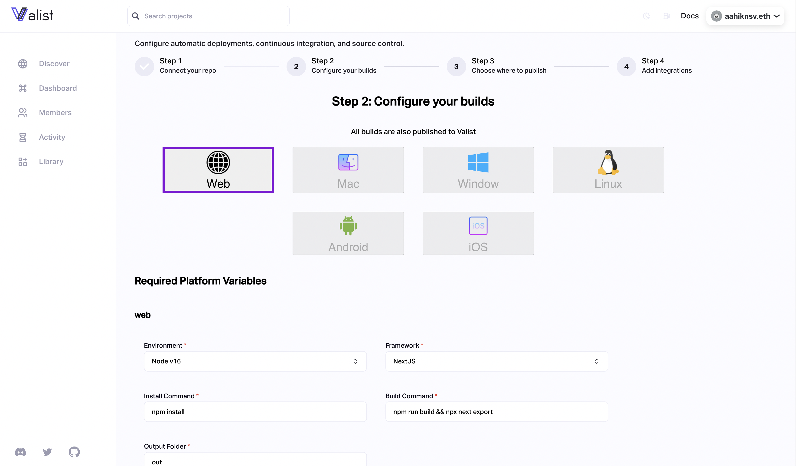

# 🚀 Publishing using CI/CD

**Go to your project page and select the deployments tab by clicking the 🚀 button.**&#x20;

### Step 1: Connect your repository

To get started, link your GitHub repository to the project you created. You can choose which branch you prefer (either `main` or `master`). This will provide Github with a developer keypair, granting it access to your Valist project.

Here's the flow that will happen:

1. The browser will securely generate a fresh, unique `Ethereum key` for your project.
2. The `public key` address will be added to the Valist Project, and the `private key` will be stored in the chosen GitHub repository as a confidential secret labeled `VALIST_SIGNER`.

This gives the GitHub Action access to your Valist project without compromising on security!

<figure><figcaption></figcaption></figure>

### Step 2: Configuring your builds

_The next step is a crucial one._&#x20;

It is essential to ensure that you have configured your builds accurately. Double-check that the environment and framework you are using match your localhost environment. This will help ensure everything runs smoothly and is properly set up.&#x20;

Additionally, you should take the time to test your build configurations before deploying them. This will help ensure that the end product meets the requirements.

<figure><figcaption></figcaption></figure>

### Step 3: Choose where to publish

After you've successfully configured your build, choose a platform where you want your project to be deployed.

_Valist will soon give you the option to select from various platforms to publish your application._

<figure><figcaption></figcaption></figure>

### Step 4: Add Integrations

Valist offers additional integrations, such as Twitter and Discord, to enhance your experience.

<figure><figcaption></figcaption></figure>

### Step 5: Deploy now! 🚀

Once you have completed the steps above, hit the `Deploy` button. A transaction will pop up that you need to sign, _but don't worry - you won't be spending any gas fees._

<figure><figcaption></figcaption></figure>

### Step 6: Merge the PR!

Once the transaction is processed, a Pull Request will be generated for your connected GitHub repository. A prompt on your screen will appear, which will direct you to the Pull Requests page.&#x20;

Merge the Pull Request and wait for Valist's Github Action to build.

<figure><figcaption></figcaption></figure>

_That's it! 🚀_ &#x20;

That's how easily you can have a CI/CD pipeline and publish your applications on Valist. You can now access this from anywhere in the Valist ecosystem, and from IPFS directly!
